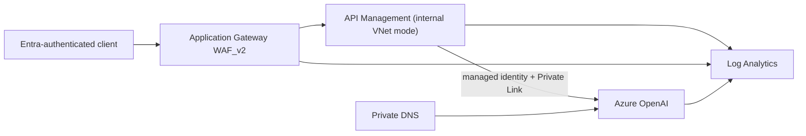

# Secure Azure OpenAI Landing Zone

An enterprise reference implementation that places Azure OpenAI behind Azure API
Management and Application Gateway WAF. The model endpoint has no public data-plane
access, local/key authentication is disabled, and API Management reaches it with a
managed identity over Private Link.

> This project creates chargeable Azure resources. Start with the `dev` parameters,
> review the what-if output, set a budget, and run the teardown command after testing.

## Example synopsis

A platform team submits a private Azure OpenAI deployment request with an Entra-authenticated APIM consumer, a per-team token budget, and chargeback tags; the blueprint produces a private, observable gateway plan without exposing the model endpoint.

## Real-world scenario

A regulated insurer wants several product teams to use generative AI without distributing model keys or allowing direct public access. This landing zone centralizes authentication, throttling, private connectivity, audit telemetry, and cost attribution so each team can innovate inside a governed boundary.

## Architecture



The gateway:

- validates a single-tenant Microsoft Entra token and audience;
- removes caller-supplied backend credentials;
- applies per-caller request and Azure OpenAI token limits;
- authenticates to Azure OpenAI with the APIM system-assigned identity;
- exposes correlation and quota headers without logging prompt or response bodies;
- denies direct public access to the Azure OpenAI account.

See [architecture](docs/architecture.md), [threat model](docs/threat-model.md),
[operations](docs/runbook.md), and [version evidence](docs/version-evidence.md).

## Prerequisites

- Azure CLI `2.85.0` or a compatible later release
- Bicep CLI `0.45.15`
- an Azure subscription with permission to create role assignments
- Azure OpenAI access and model availability in the chosen region
- an Entra application registration representing the APIM API audience
- a base64-encoded PFX and its password for the Application Gateway HTTPS listener

The deployment defaults to an empty model deployment because model names, versions,
capacity, and availability are region/subscription-specific. Supply them only after
checking current availability.

## Validate locally

```bash
./scripts/validate.sh
```

## Preview and deploy

```bash
az login
az account set --subscription "<subscription-id>"
export APPGW_CERTIFICATE_DATA="$(base64 < ./listener.pfx | tr -d '\n')"
export APPGW_CERTIFICATE_PASSWORD="<pfx-password>"

az deployment sub what-if \
  --location westeurope \
  --template-file infra/main.bicep \
  --parameters infra/environments/dev.bicepparam \
  --parameters tenantId="<tenant-id>" clientApplicationId="<application-id>"

az deployment sub create \
  --name "aoai-landing-zone-$(date +%Y%m%d%H%M%S)" \
  --location westeurope \
  --template-file infra/main.bicep \
  --parameters infra/environments/dev.bicepparam \
  --parameters tenantId="<tenant-id>" clientApplicationId="<application-id>"
```

After deployment, add the Application Gateway frontend address to the API application
registration as appropriate for your client flow. APIM subscription keys are disabled
for the API; Entra authorization is mandatory.

## Teardown

```bash
./scripts/destroy.sh "rg-aoai-lz-dev"
```

The script requires an exact resource-group name and interactive confirmation. It
does not bypass resource locks.

## Scope and limitations

- The WAF frontend is public; APIM and Azure OpenAI are private. A private-only
  Application Gateway frontend can be added for internal-only consumers.
- Semantic caching is intentionally not enabled by default because it adds a cache
  dependency and can cross privacy boundaries if the cache key is designed poorly.
  The decision is documented in ADR 0002.
- This blueprint does not create Entra applications, grant admin consent, select a
  model version, or claim regulatory certification.
- A real Azure integration deployment is required before production use.

## License

MIT. See [LICENSE](LICENSE).

## Repository guide

- [Architecture](docs/architecture.md)
- [Threat model](docs/threat-model.md)
- [Operations runbook](docs/runbook.md)
- [Security policy](SECURITY.md)
- [Contributing guide](CONTRIBUTING.md)
- [License](LICENSE)
